## Results
### Carla simulator after implementation of PID class
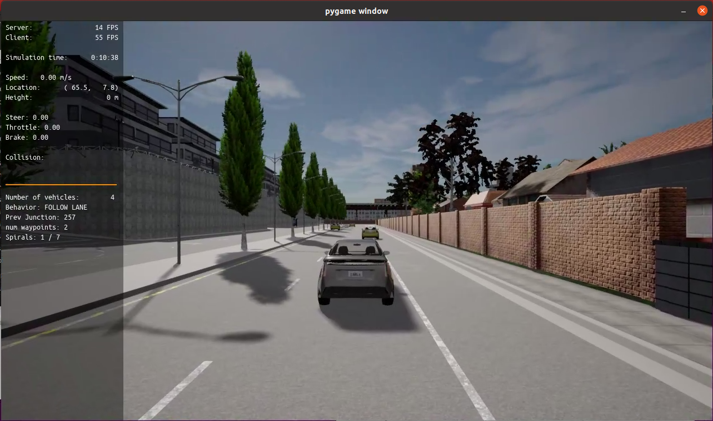

## Questions:
### 1. Add the plots to your report and explain them (describe what you see)
### Tested configurations
|  TEST  | KP_STEER | KI_STEER | KD_STEER | KP_THROTTLE | KI_THROTTLE | KD_THROTTLE |
|:------:|:--------:|:--------:|:--------:|:-----------:|:-----------:|:-----------:|
| Test 1 |   0.3    |   0      |   0   |     0.2    |    0    |     0    |
| Test 2 |   0.45   |   0.001  |   0   |     0.3    |    0     |     0    |
| Test 3 |   0.3    |   0.01   |   0   |     0.2    |    0.001  |     0    |
| Test 4 |   0.3    |   0.001   |   0   |     0.2   |    0.01   |     0     |
| Test 5 |   0.3    |   0.005   |   0   |     0.1   |    0.001  |     0     |
| Test 6 |   0.3    |   0.005   |   0   |     0.1   |    0.001  |     0    |
| Test 7 |   0.45   |   0.005  |   0   |     0.1    |    0.001  |     0    |
| Test 8 |   0.6    |   0.005  |   0   |     0.1    |    0.001  |     0    |
| Test 9 |   0.6    |   0.005   |   0.15   |    0.1 |    0.001  |     0     |
| Test 10|   0.6    |   0.005   |   0.15   |    0.15    |    0.001  |     0     |
| ...   |   ...     |   ...   |   ....   |     ....     |    ...     |     ...    |
| Test 24|   0.7    |   0.005   |   0.15   |     0.5    |    0.2     |     0.1    |

### Plots
|TEST|STEER|THROTTLE|
|:--:|:---:|:------:|
Test 1|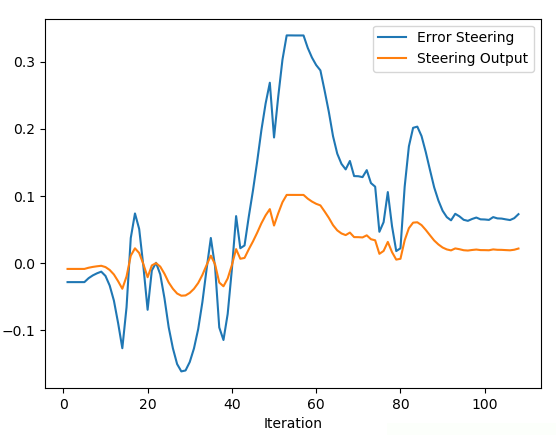 | 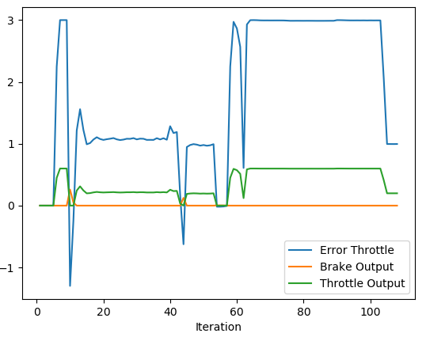
Test 2|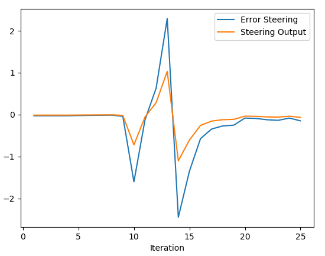 | 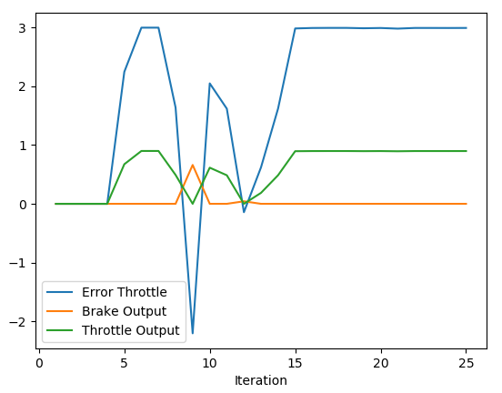
Test 3|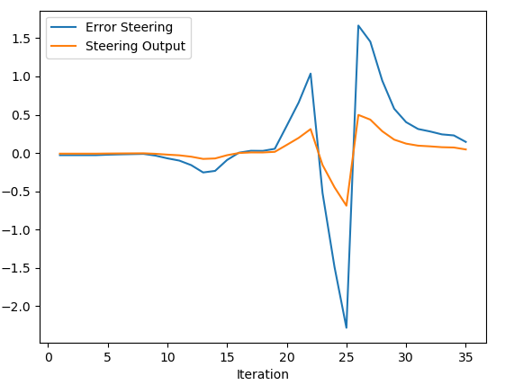 | 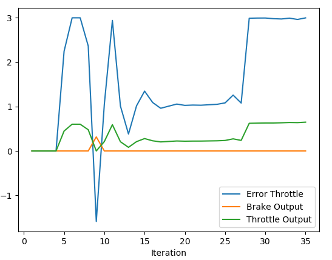
Test 4|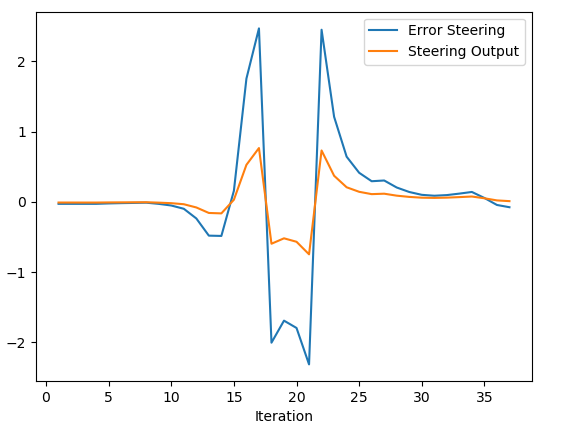 | 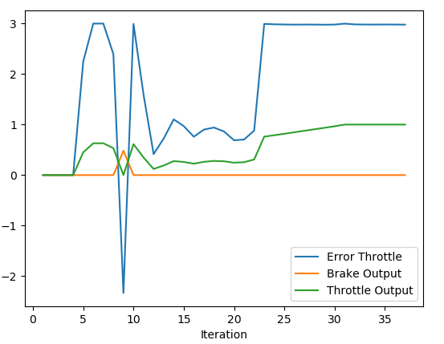
Test 5|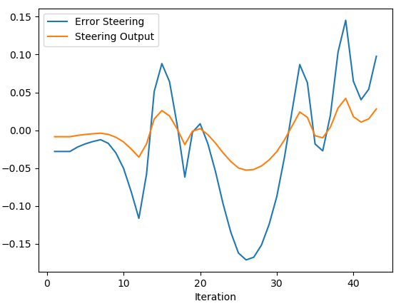 | 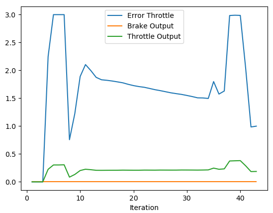
...   |... | ...
Test 24|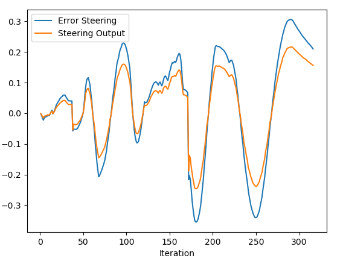 | 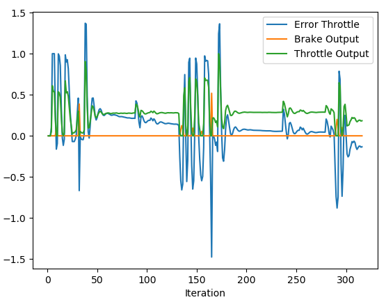

### Approach and Observations
I applied the approach described in this blog: [PID Regler einstellen in der Praxis](https://tlk-energy.de/blog/pid-regler-einstellen)

First, the proportional part has to be adjusted by setting the integral and derivative values to 0. Then the proportional has to be increased until the controller starts to become unstable and oscillates. The proportional has to be set below the point the oscillation starts, thus a small overshoot is allowed.
Secondly, the integral value gets found by constantly increasing the gain. The goal of tuning the integral value is to align the controller output with the target in the presence of noise or other disturbances. Additionally, this should be achieved in an adequate reaction time. If the controller starts to oscillate or becomes unstable, the value gets adjusted in the opposite direction.
For a lot of applications a well calibrated PI controller satisfies a good controlling. The derivative value should only be used, if the application benefits from the dampening effects of the derivative. As before, increase the derivative until the overshoot has been dampened to an acceptable level. 

The approach is challenging to implement because the desired target in the Carla Simulator changes at each time step. However, the procedure described in the blog pertains to evaluating a step response, which can only be set in the Carla Simulator by manually specifying definite driving maneuvers. Although the sequence for tuning the PID controller was followed, it was difficult to pinpoint the moment when the system behavior becomes unstable.

Another difficulty to play with was the the presence of a closed loop between the execution of the controller output and the trajectory planning. In detail, the controller defines the actual position and therefore the path planning of the next step, which in turn affects the steering and throttle error and thus the controller's input. For this reason, it is difficult to predict behavioral changes for a definite change in the controller's parametrization.

### 2. What is the effect of the PID according to the plots, how each part of the PID affects the control command?
- Proportional term `P`: a value that is proportional to the current error. A large `P` value will result in a large change in the control output. 
- Integreal term `I`: a value that is proportional to the cumulative error over time. A large `I` value speeds up the elimination of the residual steady state error produced by the system bias.
- Derivative term `D`: a value that is proportional to the rate of change of the error over time. The `D` term predicts system behavior and thus improves the settling time of the controller.

The individual effects can be well traced in the shown plots.

### 3. How would you design a way to automatically tune the PID parameters?
The "twiddle algorithm" or "coordinate ascent" algorithm can be used, as shown in Sebastian's lesson. 

In the application, in my opinion, two things need to be distinguished: firstly, controller optimization, and secondly, overall behavior. In this project, the main focus was primarily on optimizing the overall behaviour, or in other words, avoiding collisions. Here, trajectory planning and controller optimization are examined in combination. However, when it comes to the fundamental controller optimization using an automatic method, the comparison between the desired reference and the controller response should be investigated. This is best done using defined driving maneuvers.

### 4. PID controller is a model free controller, i.e. it does not use a model of the car. Could you explain the pros and cons of this type of controller?

Pros:
* PID controller is widely-used in industry, widely-studied in academia
* PID controller is easy to understand, easy to implement (no knowledge of the system needed)
* PID controller is easy to maintain (i.e., modify the parameters).

Cons:
* PID controller does not take into account the system / process (i.e., environment / vehicle dynamics) and therefore might have poor performance for complex scenarios

### 5. What would you do to improve the PID controller?
- Optimize the error calculation. Specifically, the "knowledge question" [803894](https://knowledge.udacity.com/questions/803894) and the linked questions in the answer provide a good overview of various optimization possibilities. 
- The calibration of the PID controller for the throttle seems rather poor for low velocities. This can be seen on the immediate braking after a short acceleration. Separate (and lower) P- and I-values could optimize the response for this situation.
- Using coordinate ascent to improve the controller calibration automatically